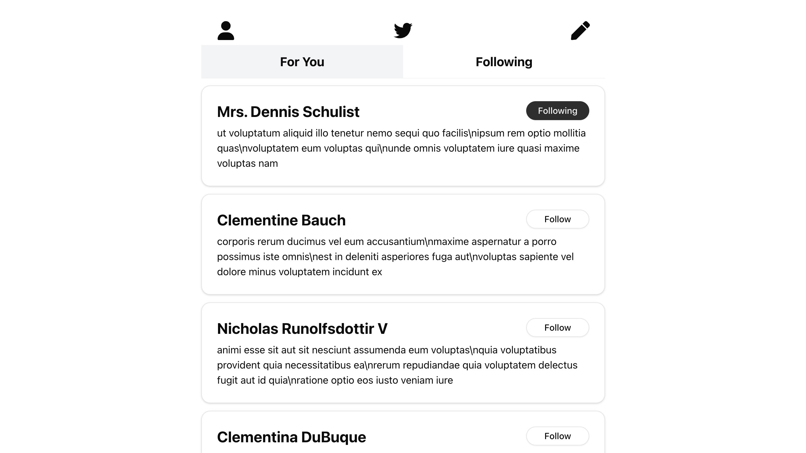

## The-View

## URL

https://next-sns-server-actions.vercel.app/

## 概要

このアプリは X（旧 Twitter）を意識した SNS 風アプリです。 
投稿・編集・削除・フォローといった基本的な SNS 機能を備えつつ、ユーザー体験を意識して  
無限スクロール や 最新の技術スタック（Server Actions / Supabase） を活用し、本格的な SNS アプリケーションとして仕上げました。

## サービスへの想い

このアプリは、Route Handlers や Server Actions、Supabase、Intersection Observer API などの技術を学ぶことを目的に作成しました。 
機能やデザインはシンプルですが、最低限の使いやすさと自然な操作感を大切にしています。 
今後は、ユーザー認証や投稿検索などの機能を追加し、より実用的なアプリへと発展させていく予定です。 

## 使用技術

- フロントエンド React 19 Next.js 15.2.3 TypeScript 5
- スタイリング Tailwind CSS 4 shadcn/ui
- バックエンド supabase 2.49.1
- デプロイ vercel

## 作者について

<a href="https://github.com/i-ji">@j-ito</a>  
<a href="https://j-ito-portfolio.vercel.app/">ポートフォリオ</a>
